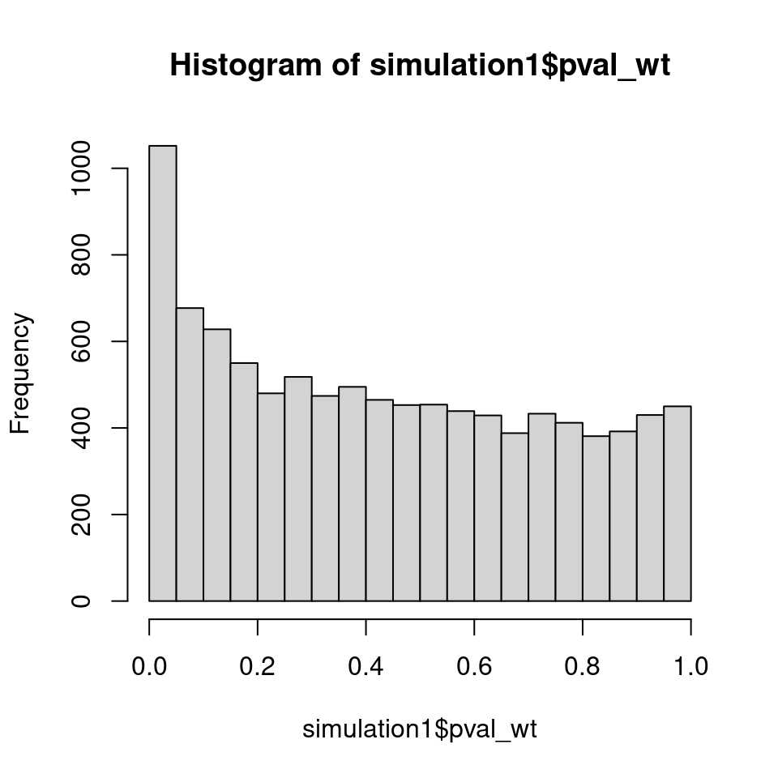
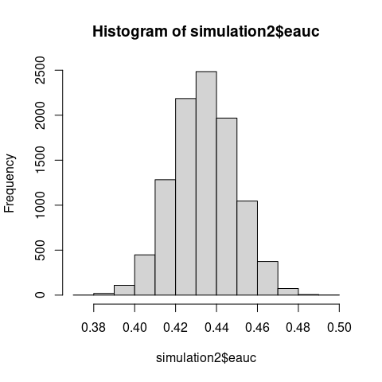
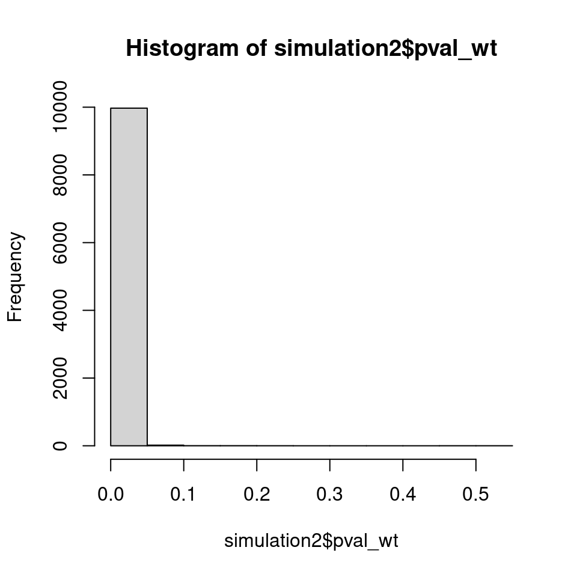
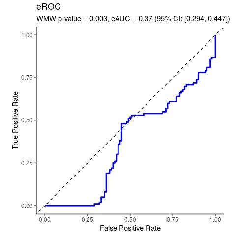
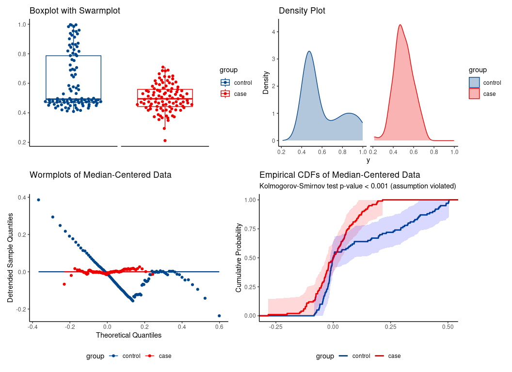
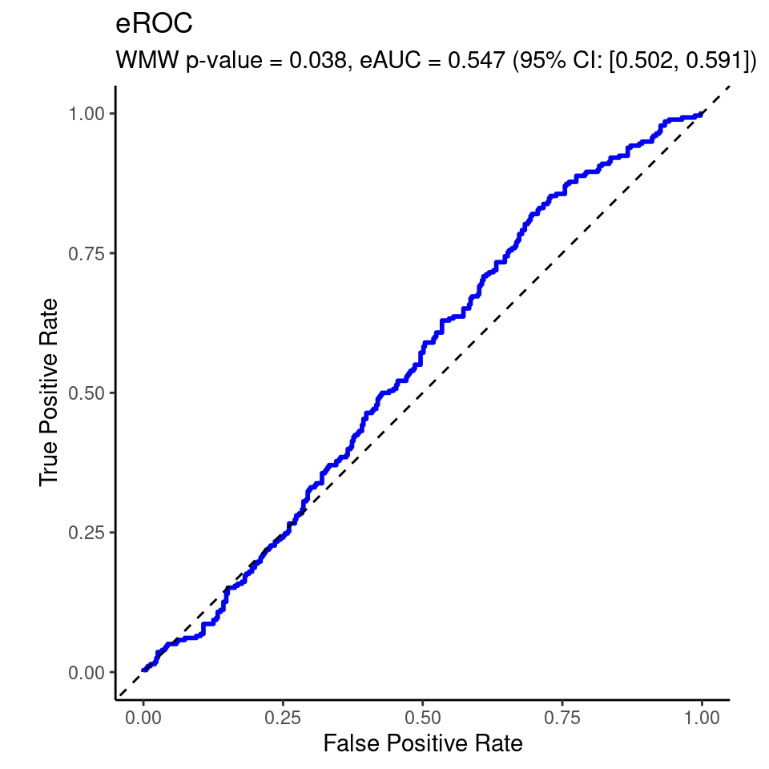
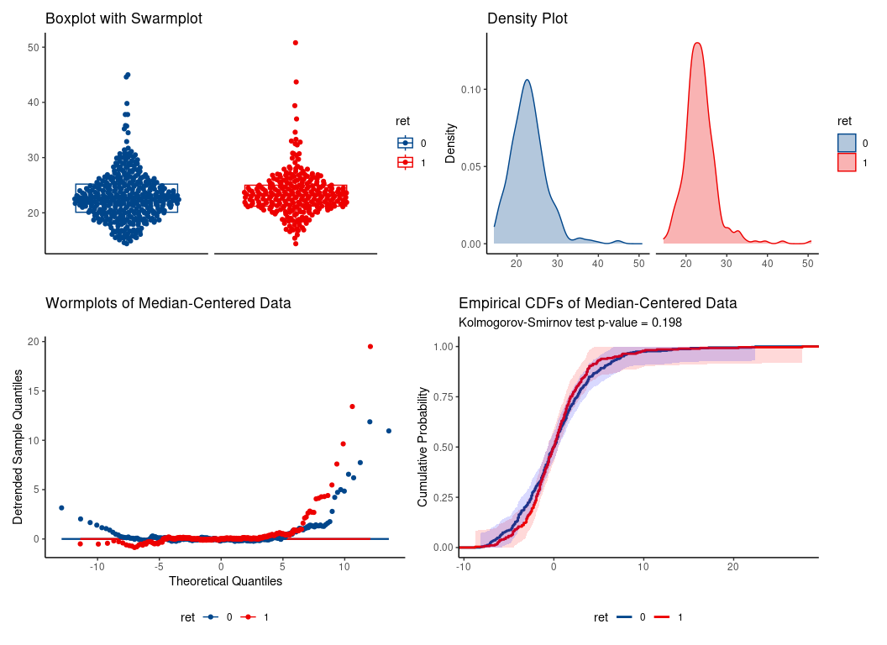
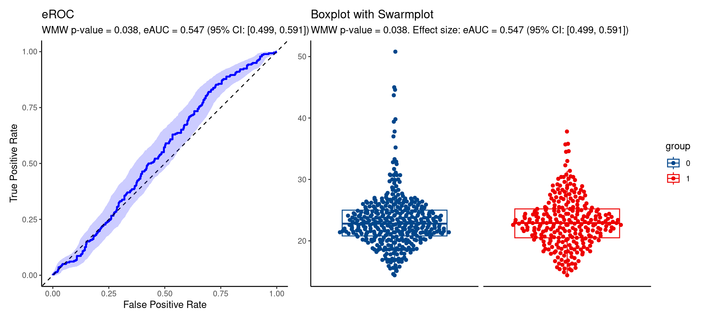

Wilcoxon-Mann-Whitney Test of No Group Discrimination (Continuous
Variables)
================

<!-- README.md is generated from README.Rmd. Please edit that file -->

# wmwAUC

<!-- badges: start -->
<!-- badges: end -->

The traditional WMW null hypothesis
$\mathrm{H_0}\textrm{:}\,\mathrm{F = G}$ is erroneously too broad. WMW
actually tests narrower $\mathrm{H_0}\textrm{:}\,\textrm{AUC} = 0.5$.
Asymptotic distribution of the standardized $U$ statistic (i.e., the
empirical AUC) under the correct $\mathrm{H_0}$ is derived along with
finite sample bias corrections. The traditional alternative hypothesis
of stochastic dominance is too narrow. WMW is consistent against
$\mathrm{H_1}\textrm{:}\,\mathrm{AUC} \neq 0.5$, as established by Van
Dantzig in 1951. See ([Grendár 2025](#ref-grendar2025wmw)).

The primary goal of wmwAUC is to provide inferences for the
Wilcoxon-Mann-Whitney test of
$\mathrm{H_0}\textrm{:}\,\mathrm{AUC} = 0.5$.

## Installation

You can install the development version of wmwAUC using

``` r
devtools::install_github('grendar/wmwAUC')
```

## Simulation 1

Consider the setting of two zero-mean different-scale gaussians. Then
the traditional $\mathrm{H_0}\textrm{:}\,\mathrm{F = G}$ of WMW test is
false and $\mathrm{H_1}\textrm{:}\,\mathrm{F \neq G}$ holds.

The Monte Carlo simulation demonstrates that the normalized test
statistic $U/(n_1n_2)$ which is just eAUC, concentrates asymptotically
on 0.5 - the value expected under a true null hypothesis.

If WMW tested distributional equality, the test statistic should not
concentrate on its null value when distributions clearly differ.

Also note that under $\mathrm{H_1}\textrm{:}\,\mathrm{F \neq G}$,
p-values should concentrate near zero, yet the observed distribution is
nearly uniform with a slightly elevated first bins, consistent with
testing a true null hypothesis ($\mathrm{AUC = 0.5}$) using
miscalibrated variance estimation.

``` r
#############################################################################
#
# Simulation 1: H0: F=G is erroneously too broad
#
#############################################################################
#
# This simulation takes several minutes to complete
# N = 10000
# n = 1000
# set.seed(123L)
# pval_wt = pval_wmw = eauc = numeric(N)
# for (i in 1:N) {
#
#  x = rnorm(n, sd = 0.1)
#   y = rnorm(n, sd = 3)
#   # wilcox.test() of H0: F = G
#   wt = wilcox.test(x, y)
#   pval_wt[i] = wt$p.value
#   # wmw_test() of H0: AUC = 0.5
#   pval_wmw[i] = wmw_pvalue(x, y)
#   # eAUC
#   eauc[i] = wt$statistic/(n*n)
#   #
# }
data(simulation1)  # List eauc, pval_wt, pval_wmw
#
```


Empirical AUC centered at 0.5 despite $\mathrm{F \neq G}$



Traditional p-values under $\mathrm{H_1}$ should concentrate near 0.


Correct p-values for testing $\mathrm{H_0\colon AUC = 0.5}$.

## Simulation 2

The two zero-mean different-scale gaussians setting does not satisfy the
traditional $\mathrm{H_1}$ of the stochastic dominance. But, as proved
by Van Dantzig in 1951, WMW is consistent for broader
$\mathrm{H_1\colon\,\textrm{AUC} \neq 0.5}$

``` r
#############################################################################
#
# Simulation 2: H1: F stoch. dominates G is too narrow
#               WMW is consistent for broader H1: AUC != 0.5   
#
#############################################################################
#
#
# This simulation takes several minutes to complete
# N = 10000
# n = 1000
# set.seed(123L)
# pval_wt = pval_wmw = eauc = numeric(N)
# for (i in 1:N) {
# #
#   # gaussians with different location and scale
#   # does not satisfy stochastic dominance
#   x = rnorm(n, 0, sd = 0.1)
#   y = rnorm(n, 0.5, sd = 3)
#   # wilcox.test H0: F = G vs H1: (F stochastically dominates G) OR (G stochastically dominates F)
#   wt = wilcox.test(x, y)
#   pval_wt[i] = wt$p.value
#   # wmw_test H0: AUC = 0.5 vs H1: AUC neq 0.5
#   pval_wmw[i] = wmw_pvalue(x, y)
#   # eAUC
#   eauc[i] = wt$statistic/(n*n)
# #
# }
data(simulation2)  # List of eauc, pval_wt, pval_wmw
# WMW detects broader alternatives than traditional stochastic dominance
```



## Simulation 3

Confidence interval for the pseudomedian is obtained by inverting the
test; see `pseudomedian_ci()` for implementation that handles the edge
cases in the same way as `wilcox.test()`.

In this simulation study, N = 500 MC replicates are created, of 300
samples from the standard normal distribution and 300 samples from the
Laplace distribution with location = 0, scale = 1. Properties of 95%
confidence intervals obtained under H0: AUC = 0.5 are compared with
those returned by `wilcox.test()`.

``` r
# #############################################################################
# #
# # Simulation 3: confidence interval for pseudomedian derived under H0: AUC = 0.5   
# #               MC study of N = 500 replicas
# #               x ~ rnorm(300, 0,1)
# #               y ~ rlaplace(300, 0,1)
# #
# #############################################################################
#
#
#
# This simulation takes long time to complete
# N <- 500
# n_test <- 300
#
# set.seed(123L)
# wmw_ci = wt_ci = list(N)
# eauc = pseudomed = numeric(N)
# for (i in 1:N) {
#  #
#  x_test <- rnorm(n_test, 0, 1)
#  y_test <- VGAM::rlaplace(n_test, 0, 1)
#
#  wmw_test <- pseudomedian_ci(x_test, y_test, conf.level = 0.95)
#  wmw_ci[[i]] = wmw_test$conf.int
#  wt_test <- wilcox.test(x_test, y_test, conf.int = TRUE)
#  wt_ci[[i]] = wt_test$conf.int
#  eauc[i] = wt_test$statistic/(n_test*n_test)
#  pseudomed[i] = as.numeric(wt_test$estimate)
#  #  
# }
#
#
data(simulation3)  # List of wmw_ci, wt_ci, eauc, pseudomedian
# 
# Average across MC of confidence intervals obtained under H0: AUC=0.5
colMeans(simulation3$wmw_ci)
#> [1] -0.1701256  0.1735400
# Average across MC of confidence intervals from wilcox.test()
colMeans(simulation3$wt_ci)
#> [1] -0.1754612  0.1790767
# 
# Average across MC of eAUC
mean(simulation3$eauc)
#> [1] 0.5004063
 
# Coverage
length(which((simulation3$wmw_ci[,1] < 0) & (simulation3$wmw_ci[,2] > 0)))
#> [1] 470
length(which((simulation3$wt_ci[,1] < 0) & (simulation3$wt_ci[,2] > 0)))
#> [1] 473

# Mean pseudomedian
mean(simulation3$pseudomed)
#> [1] 0.001776475
```

## Example 1

Real data analyzed by WMW test of no group discrimination

``` r
data(gemR::MS)
da <- MS

# preparing data frame
class(da$proteins) <- setdiff(class(da$proteins), "AsIs")
df <- as.data.frame(da$proteins)
df$MS <- da$MS
```

### Test of no group discrimination

``` r
wmd <- wmw_test(P19099 ~ MS, data = df, ref_level = 'no')
wmd
#> 
#>         Wilcoxon-Mann-Whitney Test of No Group Discrimination
#> 
#> data: P19099 by MS (n1 = 37, n2 = 64)
#> groups: yes vs no (reference)
#> W = 1726, p-value = 0.001131
#> alternative hypothesis for AUC: two.sided 
#> 95 percent confidence interval for AUC (hanley): 
#>  0.623 0.835
#> empirical AUC (eAUC):
#>  0.729
```


## Example 2

Synthetic data illustrating the special case of location shift
assumption.

``` r
data(Ex2)
da <- Ex2

# WMW test
wmd <- wmw_test(y ~ group, data = da, ref_level = 'control')
wmd
#> 
#>         Wilcoxon-Mann-Whitney Test of No Group Discrimination
#> 
#> data: y by group (n1 = 100, n2 = 100)
#> groups: case vs control (reference)
#> W = 3705, p-value = 0.003197
#> alternative hypothesis for AUC: two.sided 
#> 95 percent confidence interval for AUC (hanley): 
#>  0.294 0.447
#> empirical AUC (eAUC):
#>  0.370
```



### Check location-shift assumption with EDA


**location-shift assumption not tenable**.

*Erroneous* use of location-shift special case of WMW would falsely
conclude significant median difference despite identical medians

    #> 
    #>         Wilcoxon-Mann-Whitney Test of No Group Discrimination
    #> 
    #> data: y by group (n1 = 100, n2 = 100)
    #> groups: case vs control (reference)
    #> W = 3705, p-value = 0.003197
    #> alternative hypothesis for AUC: two.sided 
    #> 95 percent confidence interval for AUC (hanley): 
    #>  0.294 0.447
    #> empirical AUC (eAUC):
    #>  0.370 [discrimination effect size]
    #> 
    #> Location-shift analysis (under F1(x) = F2(x - delta)):
    #> alternative hypothesis for location: two.sided 
    #> 95 percent confidence interval for median of all pairwise distances:
    #>  -0.101 -0.017
    #> Hodges-Lehmann median of all pairwise distances:
    #>  -0.048 [location effect size: eAUC = 0.370]

Indeed, the medians are essentially the same:

``` r
median(da$y[da$group == 'case'])
#> [1] 0.4949383
median(da$y[da$group == 'control'])
#> [1] 0.4926145
```

## Example 3

WMW applied to another real-life data set.

WARNING: the data contain ties. Current version of wmwAUC package does
not take ties into account.

``` r
data(wesdr)
da = wesdr
da$ret = as.factor(da$ret)
# WMW 
wmd <- wmw_test(bmi ~ ret, data = da, ref_level = '0')
wmd
#> 
#>         Wilcoxon-Mann-Whitney Test of No Group Discrimination
#> 
#> data: bmi by ret (n1 = 278, n2 = 391)
#> groups: 1 vs 0 (reference)
#> W = 59417.5, p-value = 0.037970
#> alternative hypothesis for AUC: two.sided 
#> 95 percent confidence interval for AUC (hanley): 
#>  0.502 0.591
#> empirical AUC (eAUC):
#>  0.547
```



### EDA to assess location shift assumption validity


hence, **location shift assumption is tenable**

### Special case of WMW test

``` r
suppressWarnings({ # ties in data
wml <- wmw_test(bmi ~ ret, data = da, ref_level = '0', 
                 ci_method = 'boot', special_case = TRUE)
})                 
wml
#> 
#>         Wilcoxon-Mann-Whitney Test of No Group Discrimination
#> 
#> data: bmi by ret (n1 = 278, n2 = 391)
#> groups: 1 vs 0 (reference)
#> W = 59417.5, p-value = 0.037970
#> alternative hypothesis for AUC: two.sided 
#> 95 percent confidence interval for AUC (boot): 
#>  0.499 0.591
#> empirical AUC (eAUC):
#>  0.547 [discrimination effect size]
#> 
#> Location-shift analysis (under F1(x) = F2(x - delta)):
#> alternative hypothesis for location: two.sided 
#> 95 percent confidence interval for median of all pairwise distances:
#>  0.025 1.054
#> Hodges-Lehmann median of all pairwise distances:
#>  0.600 [location effect size: eAUC = 0.547]
```

Plot


# Acknowledgements

AI-assisted code generation via Claude Pro by Anthropic was used in
development. All generated content was verified, tested, and enhanced by
the package author.

# References

<div id="refs" class="references csl-bib-body hanging-indent"
entry-spacing="0">

<div id="ref-grendar2025wmw" class="csl-entry">

Grendár, Marian. 2025. “Wilcoxon-Mann-Whitney Test of No Group
Discrimination.” 2025. <https://arxiv.org/abs/2511.20308>.

</div>

</div>
