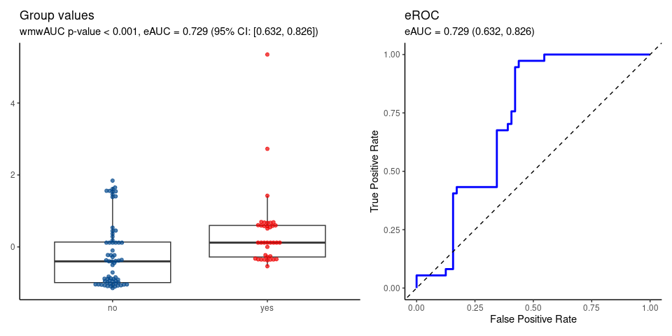
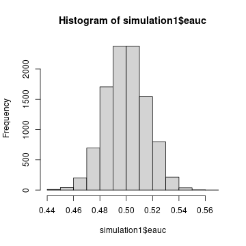
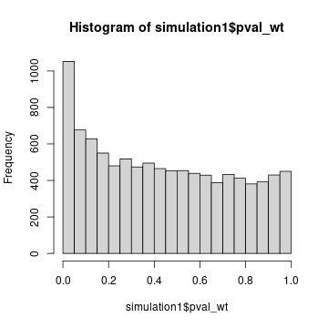
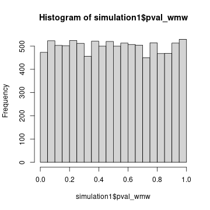
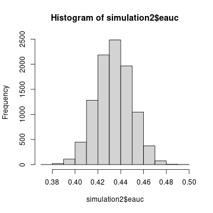
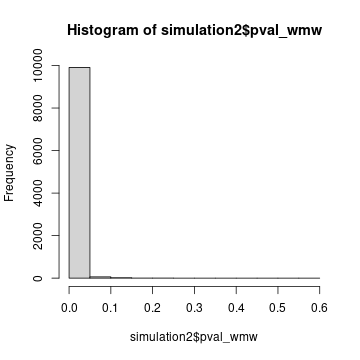
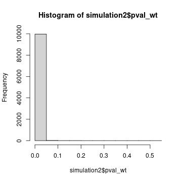

wmwAUC Test of No Group Discrimination
================

<!-- README.md is generated from README.Rmd. Please edit that file -->
<!-- badges: start -->

[](https://cran.r-project.org/package=wmwAUC)
[](https://github.com/grendar/wmwAUC)
[](https://cran.r-project.org/package=wmwAUC)

<!-- badges: end -->

The classical Wilcoxon-Mann-Whitney (WMW) test is calibrated under the
null hypothesis $\mathrm{H_0\colon F = G}$. However, the WMW test
statistic, when standardized, is the empirical AUC (eAUC), and hence the
test in fact assesses the set
$\lbrace\mathrm{(F,G)\colon AUC = 0.5}\rbrace$, which does not match
$\mathrm{H_0\colon F = G}$. This incoherence ([Grendár
2026](#ref-grendar2026dct)) causes that WMW test provides erroneous
inferences.

**wmwAUC** implements a properly calibrated test of
$\mathrm{H_0\colon AUC = 0.5}$ based on the WMW statistic; for details,
see ([Grendár 2025](#ref-grendar2025wmw)). The package provides both
asymptotic inference and two finite-sample bias-correction methods:

- *Exact Unbiased* (EU) Method: Universal approach handling data with
  arbitrary tie patterns through the mid-rank kernel and exact
  finite-sample unbiased variance estimation from Hoeffding
  decomposition theory. Reduces correctly to the continuous case when no
  ties are present.

- *Bias-Corrected* (BC) Method: Alternative method using individual
  placement-component bias correction with $O(n^{-1})$ finite-sample
  corrections and Welch-Satterthwaite degrees of freedom. Derived for
  continuous data (Sect. 4 of the paper); the implementation extends
  this to ties via the same mid-rank kernel as EU, with conservative
  behavior confirmed by simulation to persist under ties.

The EU method serves as the default implementation, providing:

- Universal applicability (handles any data type - continuous, discrete,
  or mixed)

- Exact finite-sample unbiasedness (not asymptotic approximation)

- Theoretically principled tie handling through mid-rank kernel

- Retained real power at small sample sizes where BC’s power can be
  close to zero

BC remains available for users who specifically want its more
conservative behavior.

Key functions include:

- `wmwAUC_test()`: Main testing function, defaulting to the EU method,
  with an option to select BC instead

- `wmwAUC_pvalue_BC()`: WMW AUC p-values via the BC method

- `wmwAUC_pvalue_EU()`: WMW AUC p-values via the EU method, valid for
  any tie pattern

- `wmwAUC_pseudomedian_ci()`: Confidence interval for the AUC-equalizing
  shift (pseudomedian), obtained by inverting the test

(The old names `wmw_test()`, `wmw_pvalue()`, `wmw_pvalue_ties()`, and
`pseudomedian_ci()` are not retained as functional aliases. Calling any
of them raises an informative error naming the current function to use
instead.)

## Installation

Install the released version from CRAN:

``` r
install.packages("wmwAUC")
```

Or the development version from GitHub:

``` r
# install.packages("remotes")
remotes::install_github("grendar/wmwAUC")
```

## Example

Real data analyzed by wmwAUC test of no group discrimination.

``` r
data(gemR::MS)
da <- MS

# preparing data frame
class(da$proteins) <- setdiff(class(da$proteins), "AsIs")
df <- as.data.frame(da$proteins)
df$MS <- da$MS
```

### wmwAUC test of no group discrimination

``` r
wmd <- wmwAUC_test(P19099 ~ MS, data = df, ref_level = 'no')
wmd
#> 
#>         wmwAUC Test of No Group Discrimination (H0: AUC = 1/2)
#> 
#> data: P19099 by MS (n1 = 37, n2 = 64)
#> groups: yes vs no (reference)
#> U = 1726, eAUC = 0.729, p-value = 0.000012, method = EU
#> alternative hypothesis for AUC: two.sided 
#> 95 percent confidence interval for AUC (delong): 
#>  0.632 0.826
```



### AUC-equalizing shift (pseudomedian)

``` r
set.seed(123L)
wmd_pm <- wmwAUC_test(P19099 ~ MS, data = df, ref_level = 'no', pseudomedian = TRUE)
wmd_pm
#> 
#>         wmwAUC Test of No Group Discrimination (H0: AUC = 1/2)
#> 
#> data: P19099 by MS (n1 = 37, n2 = 64)
#> groups: yes vs no (reference)
#> U = 1726, eAUC = 0.729, p-value = 0.000012, method = EU
#> alternative hypothesis for AUC: two.sided 
#> 95 percent confidence interval for AUC (delong): 
#>  0.632 0.826
#> 
#> AUC-equalizing shift (pseudomedian):
#>  0.642 [solves P(X < Y + delta) = 0.5]
#> 95 percent confidence interval for the pseudomedian:
#>  0.465 0.934
```

## Monte Carlo simulations

Through Monte Carlo analysis of *zero-mean heteroskedastic Gaussians*
and corresponding asymptotic theory, we demonstrate the mismatch between
the null of the WMW test and the statistic-implied null set directly:
the eAUC concentrates on 0.5 even when $\mathrm{F \neq G}$, showing that
the classical WMW test’s calibration cannot be tracking distributional
equality.

### Simulation 1

Consider the setting of two zero-mean different-scale gaussians. Then
the traditional $\mathrm{H_0\colon F = G}$ of the classical WMW test is
false and $\mathrm{H_0\colon F \neq G}$ holds.

The Monte Carlo simulation demonstrates that the normalized test
statistic $U/(n_1n_2)$ which is just eAUC, concentrates asymptotically
on 0.5 - the value expected under a true null hypothesis.

If the classical WMW test tested distributional equality, the test
statistic should not concentrate on its null value when distributions
clearly differ.

Also note that under $\mathrm{H_0\colon F \neq G}$, p-values should
concentrate near zero, yet the observed distribution is nearly uniform
with a slightly elevated first bins, consistent with testing a true null
hypothesis ($\mathrm{H_0\colon AUC = 0.5}$) using miscalibrated variance
estimation.

``` r
#############################################################################
#
# Simulation 1: H0: F=G is erroneously too broad
#
#############################################################################
#
# This simulation takes several minutes to complete
# N = 10000
# n = 1000
# set.seed(123L)
# pval_wt = pval_wmwAUC = eauc = numeric(N)
# for (i in 1:N) {
#
#   x = rnorm(n, sd = 0.1)
#   y = rnorm(n, sd = 3)
#   # wilcox.test() of H0: F = G
#   wt = wilcox.test(x, y)
#   pval_wt[i] = wt$p.value
#   # wmwAUC_test() of H0: AUC = 0.5
#   pval_wmwAUC[i] = wmwAUC_pvalue_BC(x, y)
#   # eAUC
#   eauc[i] = wt$statistic/(n*n)
#   #
# }
data(simulation1)  # List eauc, pval_wt, pval_wmwAUC
#
```



Empirical AUC centered at 0.5 despite $\mathrm{F \neq G}$.



Traditional p-values under $\mathrm{H_1}$ should concentrate near 0.



Correct p-values for testing $\mathrm{H_0\colon AUC = 0.5}$.

### Simulation 2

The two zero-mean different-scale gaussians setting does not satisfy the
traditional $\mathrm{H_1}$ of the stochastic dominance. But, as proved
by Van Dantzig in 1951, the WMW statistic is consistent for the broader
$\mathrm{H_1\colon AUC \neq 0.5}$. The following MC simulation
demonstrates the consistency.

``` r
#############################################################################
#
# Simulation 2: H1: F stoch. dominates G is too narrow
#               WMW is consistent for broader H1: AUC != 0.5   
#
#############################################################################
#
#
# This simulation takes several minutes to complete
# N = 10000
# n = 1000
# set.seed(123L)
# pval_wt = pval_wmwAUC = eauc = numeric(N)
# for (i in 1:N) {
# #
#   # gaussians with different location and scale
#   # does not satisfy stochastic dominance
#   x = rnorm(n, 0, sd = 0.1)
#   y = rnorm(n, 0.5, sd = 3)
#   # wilcox.test H0: F = G vs H1: (F stochastically dominates G) OR (G stochastically dominates F)
#   wt = wilcox.test(x, y)
#   pval_wt[i] = wt$p.value
#   # wmwAUC_test H0: AUC = 0.5 vs H1: AUC neq 0.5
#   pval_wmwAUC[i] = wmwAUC_pvalue_BC(x, y)
#   # eAUC
#   eauc[i] = wt$statistic/(n*n)
# #
# }
data(simulation2)  # List of eauc, pval_wt, pval_wmwAUC
# WMW detects broader alternatives than traditional stochastic dominance
```



# Acknowledgements

AI-assisted code generation via Claude Pro by Anthropic was used in
development. All generated content was verified, tested, and enhanced by
the package author.

# References

<div id="refs" class="references csl-bib-body hanging-indent"
entry-spacing="0">

<div id="ref-grendar2025wmw" class="csl-entry">

Grendár, Marian. 2025. “Wilcoxon-Mann-Whitney Test of No Group
Discrimination.” 2025. <https://arxiv.org/abs/2511.20308>.

</div>

<div id="ref-grendar2026dct" class="csl-entry">

———. 2026. “Detection Coherence of Tests.” 2026.
<https://arxiv.org/abs/2608.11177>.

</div>

</div>
